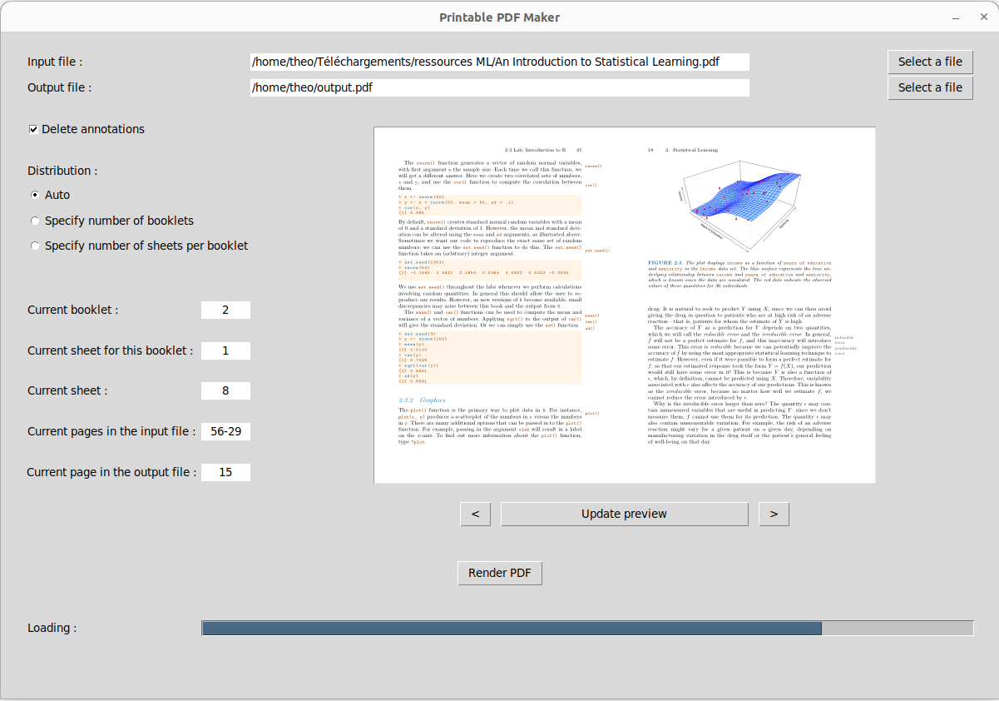
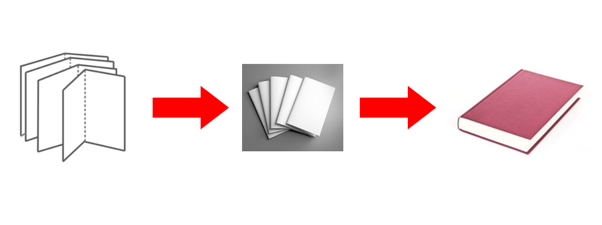
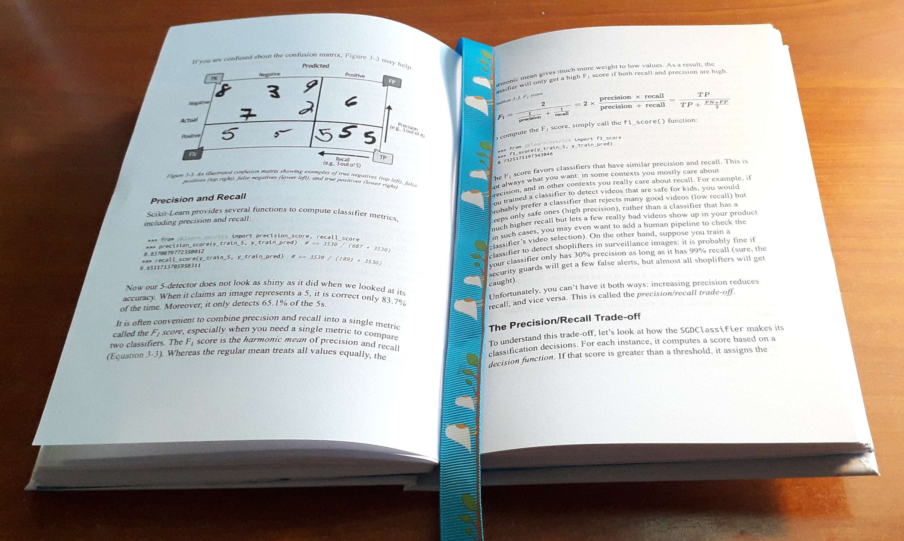
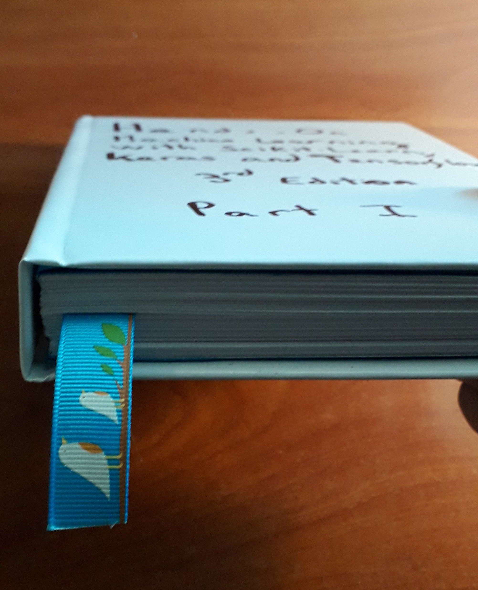

# Pdf2Book

Pdf2Book is a tool that transforms PDF files into a format suitable for printing and folding into booklets. It works by rearranging the pages of a PDF file so that they can be printed on both sides of a sheet of paper and then folded in half to create a booklet.

## Installation
```bash
git clone https://github.com/Th3o-D/pdf2book.git
cd pdf2book
pip install -r requirements.txt
```

The `temp/` folder is where previews and other temporary files are stored, don't delete it.

## Usage
To use the PDF Booklet Maker, start by loading the file you want to convert. Once the file is loaded, a preview of the converted booklet will be displayed, allowing you to see the result of the conversion.

You can then customize the conversion process using the following options:
+ Delete annotations: This option allows you to remove annotations from the original PDF file that may interfere with the booklet layout, causing them to be displayed incorrectly or in the wrong place.
+ Number of empty pages: If you plan to add a cover to your book, you may want to add a few blank pages at the beginning and at the end of the PDF file, in order to glue them to the cover. This option allows you to specify the number of blank pages you want to add to the beginning and end of the PDF file (might most often be 1 or 2, depending on if you want to have your first page to be the
back of the one glued to the cover or the next one).
+ Distribution:
    + Auto: The Auto option automatically calculates the number of booklets to create an average of 7 sheets per booklet based on the number of pages in the PDF file.
    + Specify number of booklets: This option allows you to specify the number of booklets you want to print, and then the program calculates the number of sheets per booklet required to achieve this.
    + Specify number of sheets per booklet: This option lets you set the number of sheets you want to print per booklet, and then calculates the number of booklets required to print the entire PDF file.

If you make any changes to these options, you can update the preview by clicking on the "Update preview" button or by previewing another page.

Once you're satisfied with the preview, you can render the PDF by clicking on the "Render PDF" button. The rendering process will display a progress bar, indicating the estimated time remaining for the PDF rendering. During the rendering process, you can continue to change the conversion options or preview other files since the rendering and preview processes are independent.

Here is an image of the application :



After the PDF has been generated, utilize duplex printing and then follow the given instructions to arrange the sheets:


If you want more information about the process, you can watch theses videos :
+ [Assembling the booklets](https://www.youtube.com/watch?v=9O4kFTOEh6k)
+ [Make the text block](https://www.youtube.com/watch?v=XGQ5P8QVHSg)
+ [Add a hard cover to your book](https://www.youtube.com/watch?v=Av_rU-yOPd4)

This is if you want a high quality result, but if you don't care about the quality, you can just staple/glue the sheets together and it will work too.

Here is a less time-consuming method, with prong paper fasteners. First, cut all the sheets in half, and be shure to keep the order of the pages.
You dont have booklets anymore, but the software is still useful to arrange the pages in the right order, which page goes with which one for each half sheet.
+ [How to make a book with prong paper fasteners](https://www.youtube.com/watch?v=Tey13CS4aps)

If you use the first method, before assembling the booklets, you may want to cut the edges of the sheets with a guillotine paper cutter (or something similar) for each booklet to make them the same size once you fold them.

It's important to keep in mind that if the original PDF pages are of varying sizes, a few of them might get cropped or not show correctly. The software tries to adjust the size based on the most frequently occurring page size in the input PDF file.

Here is an example of a book I made using this software :

<div style="display:flex">
    <div>
        <br>
    </div>
    <div>
        <br>
        
    </div/>
</div>


<div align="right" style="display: flex">
    
    <a href="https://github.com/Th3o-D" alt="https://github.com/Th3o-D"></a>
    <a href="LICENSE" alt="licence"></a>
</div>
