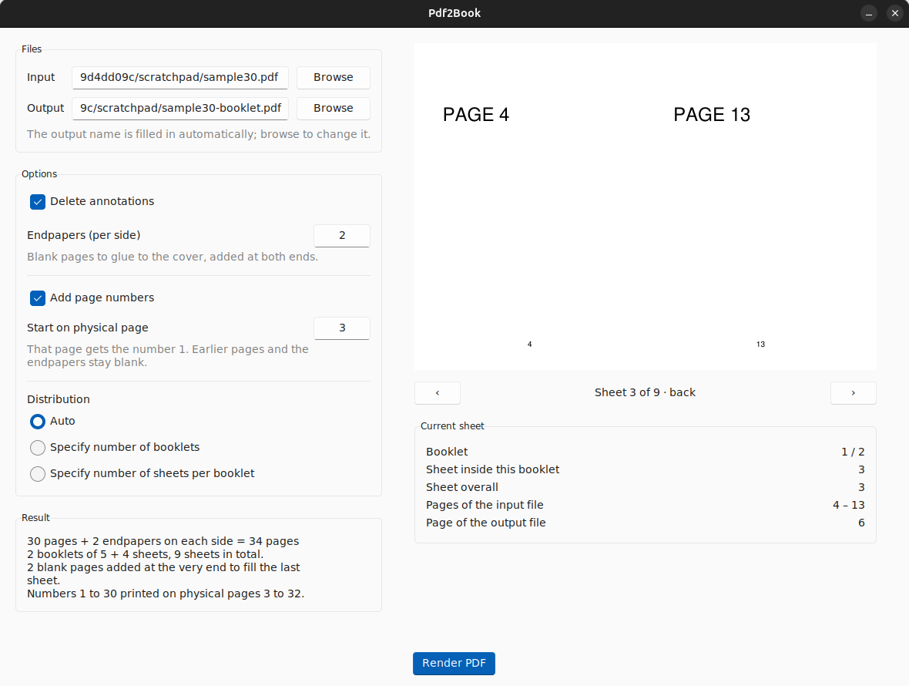
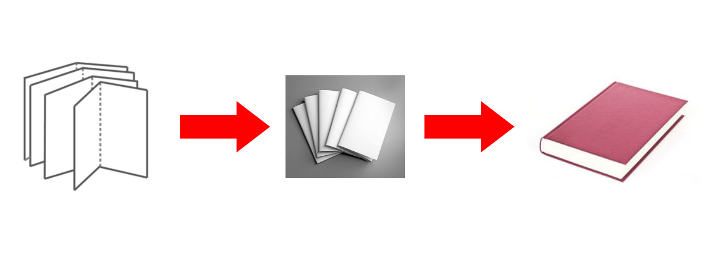
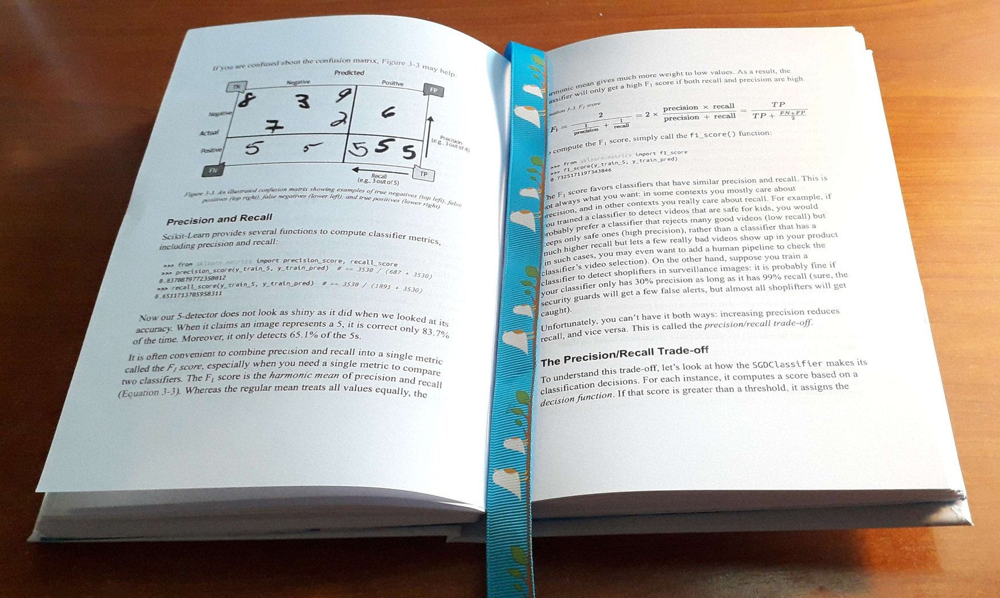
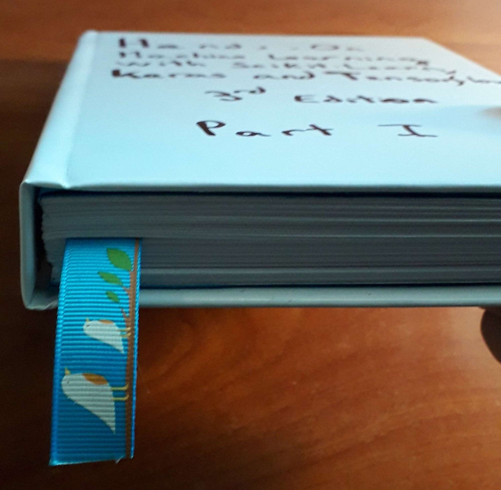

# Pdf2Book

Pdf2Book is a tool that transforms PDF files into a format suitable for printing and folding into booklets. It works by rearranging the pages of a PDF file so that they can be printed on both sides of a sheet of paper and then folded in half to create a booklet.

## Installation
```bash
git clone https://github.com/theodubus/pdf2book.git
cd pdf2book
pip install -r requirements.txt
```

You will also need to install `tkinter`, you can do it via `pip` but it might not work on macOS or some Linux distributions, so you can also [install it via your package manager](https://stackoverflow.com/questions/25905540/importerror-no-module-named-tkinter).

Once you have installed the dependencies, you can run the application by running the `main.py` file:

```bash
python main.py
```

Previews and the intermediate files are built in memory, so the application does not write anything outside the output file you choose.

The tests cover the page-ordering logic and the page-fitting rules:

```bash
pip install pytest
pytest
```

## Usage
Start by loading the file you want to convert. A preview of the first printed side appears straight away, and the output file is named for you next to the input one (`book.pdf` becomes `book-booklet.pdf`); use the "Browse" button next to it if you want somewhere else.

You can then customize the conversion process using the following options:
+ Delete annotations: This option allows you to remove annotations from the original PDF file that may interfere with the booklet layout, causing them to be displayed incorrectly or in the wrong place.
+ Endpapers (per side): If you plan to add a cover to your book, you may want to add a few blank pages at the beginning and at the end of the PDF file, in order to glue them to the cover. This option allows you to specify the number of blank pages you want to add to the beginning and end of the PDF file (might most often be 1 or 2, depending on if you want to have your first page to be the
back of the one glued to the cover or the next one). This is a binding choice and is separate from the blank pages the program adds on its own to fill the last sheet — the "Result" panel tells you how many of those there are.
+ Add page numbers: For PDF files that carry no numbering of their own, this stamps a number at the bottom centre of each page. "Start on physical page" tells it where to begin, counting the physical pages of the book being printed, endpapers included — so with 2 endpapers you would start on page 3. That first page gets the number 1, everything before it stays blank, and the endpapers at the end are never numbered. The "Result" panel spells out the range it will use.
+ Distribution:
    + Auto: The Auto option automatically calculates the number of booklets to create an average of 7 sheets per booklet based on the number of pages in the PDF file.
    + Specify number of booklets: This option allows you to specify the number of booklets you want to print, and then the program calculates the number of sheets per booklet required to achieve this.
    + Specify number of sheets per booklet: This option lets you set the number of sheets you want to print per booklet, and then calculates the number of booklets required to print the entire PDF file. This is a target: once the number of booklets is derived, the sheets are shared out evenly between them, so a few booklets may end up one sheet short.

The preview follows the options as you change them, so there is nothing to click to refresh it. Browse the printed sides with the arrow buttons or the left and right arrow keys; the panel below tells you which booklet and which sheet you are looking at, whether it is the front or the back, and which pages of your original file it carries.

Once you're satisfied with the preview, you can render the PDF by clicking on the "Render PDF" button. A progress bar tracks the rendering. During the rendering process, you can continue to change the conversion options or browse the preview, since the rendering and preview processes are independent.

Here is an image of the application :



After the PDF has been generated, utilize duplex printing and then follow the given instructions to arrange the sheets:


If you want more information about the process, you can watch theses videos :
+ [Assembling the booklets](https://www.youtube.com/watch?v=9O4kFTOEh6k)
+ [Make the text block](https://www.youtube.com/watch?v=XGQ5P8QVHSg)
+ [Add a hard cover to your book](https://www.youtube.com/watch?v=Av_rU-yOPd4)

This is if you want a high quality result, but if you don't care about the quality, you can just staple/glue the sheets together and it will work too.

Here is a less time-consuming method, with prong paper fasteners. First, cut all the sheets in half, and be shure to keep the order of the pages.
You dont have booklets anymore, but the software is still useful to arrange the pages in the right order, which page goes with which one for each half sheet.
+ [How to make a book with prong paper fasteners](https://www.youtube.com/watch?v=Tey13CS4aps)

If you use the first method, before assembling the booklets, you may want to cut the edges of the sheets with a guillotine paper cutter (or something similar) for each booklet to make them the same size once you fold them.

If the original PDF mixes several page sizes, the software picks the most frequent one as the reference format and fits the other pages into it. Their proportions are preserved, so a page of a different format keeps its shape and is centered, with white margins around it rather than being stretched. A page whose orientation is the opposite of the reference one (a landscape chart in a portrait document, for instance) is rotated a quarter turn so that it still fills its half of the sheet: turn the book clockwise to read it.

Here is an example of a book I made using this software :

<table>
  <tr>
    <td rowspan="2" style="border: none"></td>
    <td></td>
  </tr>
  <tr>
    <td></td>
  </tr>
</table>

<div align="right" style="display: flex">
    
    <a href="https://github.com/theodubus" alt="https://github.com/theodubus"></a>
    <a href="LICENSE" alt="licence"></a>
</div>
